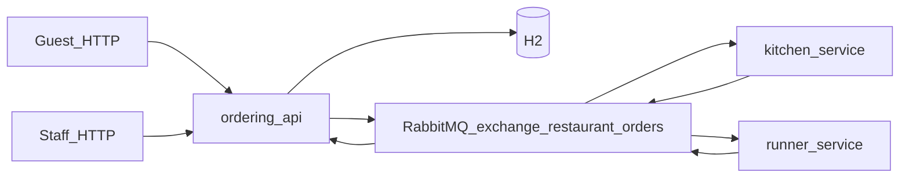

# Restaurant Ordering System

Kotlin multi-module demo of a guest ordering API (Ktor + H2 + Exposed), asynchronous kitchen and runner workflows via RabbitMQ, and shared domain/events in `common`.

## System design

| Component | Role |
|-----------|------|
| **ordering-api** | REST for guests and staff, H2 persistence, publishes `OrderPlacedEvent` (`order.new`) and `DishPreparedEvent` (`dish.ready`) when staff POST `ready-to-serve`; consumes `order.preparing`, `dish.ready`, and `delivery.confirmed` to advance `OrderStatus`. |
| **kitchen-service** | Consumes `order.new`, publishes `OrderPreparingEvent` (`order.preparing`) only — no `dish.ready` (staff confirm that via ordering-api). |
| **runner-service** | Consumes `dish.ready`, logs delivery, publishes `DeliveryConfirmedEvent` (`delivery.confirmed`). |



### RabbitMQ topology

Defined in [`common/.../RestaurantRabbitTopology.kt`](common/src/main/kotlin/com/restaurant/common/RestaurantRabbitTopology.kt):

- **Business exchange:** configurable (HOCON `restaurant.rabbitMq.exchangeName` / env `RABBITMQ_EXCHANGE`), default `restaurant.orders` (topic, durable)
- **Dead-letter exchange:** `restaurant.orders.dlx` (direct, durable) — when a consumer **nacks without requeue** (for example malformed JSON), the broker routes the message to a `*.dlq` queue instead of spinning forever
- **Queues (durable):**
  - `kitchen.orders` ← `order.new` (+ DLQ `kitchen.orders.dlq`)
  - `runner.delivery` ← `dish.ready` (+ DLQ `runner.delivery.dlq`)
  - `ordering.updates` ← `order.preparing`, `dish.ready`, `delivery.confirmed` (+ DLQ `ordering.updates.dlq`)

`dish.ready` is published by **ordering-api** when staff call `POST /order/{id}/ready-to-serve`, then consumed from separate queues by **runner** (physical delivery) and **ordering-api** ([`OrderingUpdatesConsumer`](ordering-api/src/main/kotlin/com/restaurant/ordering/infrastructure/messaging/OrderingUpdatesConsumer.kt) sets status `READY_TO_SERVE`).

**Changing DLQ / queue arguments:** RabbitMQ rejects `queueDeclare` if a queue already exists with different arguments. After pulling topology changes, recreate volumes or drop old queues (for example `docker compose down -v` in dev).

### Order status

`PLACED` → `PREPARING` → `READY_TO_SERVE` → `SERVED`

`POST /order/{id}/ready-to-serve` is allowed from `PREPARING` and returns **204**. A repeat call while already `READY_TO_SERVE` also returns **204** without publishing another `dish.ready` (idempotent for this demo).

### Resilience (demo scope)

- **Connection:** [`RabbitConnectionSupport`](common/src/main/kotlin/com/restaurant/common/RabbitConnectionSupport.kt) retries RabbitMQ connections with exponential backoff.
- **Publishers (ordering-api):** persistent message bodies (`deliveryMode=2`), **publisher confirms** with a bounded wait, and **`synchronized(channel)`** around publish+confirm so concurrent HTTP threads cannot share an unsafe Rabbit `Channel`.
- **Consumers:** [`consumeManualAck`](common/src/main/kotlin/com/restaurant/common/RabbitConsumerSupport.kt) **requeues** likely-transient failures (for example database errors) and **does not requeue** `kotlinx.serialization` failures so poison JSON goes to the **DLQ** via queue arguments.
- **Lifecycle DB writes:** [`applyLifecycleStatus`](ordering-api/src/main/kotlin/com/restaurant/ordering/infrastructure/persistence/ExposedOrderRepository.kt) (port on [`OrderRepository`](ordering-api/src/main/kotlin/com/restaurant/ordering/domain/OrderRepository.kt)) only advances (or idempotently repeats) allowed transitions so Rabbit redeliveries cannot move an order backwards (for example from `SERVED` to `READY_TO_SERVE`).
- **Shutdown:** JVM shutdown hooks close consumer/publish **channels** before the **connection** (with a timeout) so in-flight deliveries can settle best-effort under SIGTERM.

See [Future work](#future-work) below for the production hardening backlog.

## Prerequisites

- JDK **17+** (project toolchains target 17). For **JDK 26+**, this repo uses **Gradle 9.2** and **Kotlin 2.2** so the toolchain and Gradle daemon stay compatible.
- Docker (optional, for Compose).

## Configuration (HOCON and environment variables)

Defaults and structure live in classpath HOCON: [`common/src/main/resources/application.conf`](common/src/main/resources/application.conf) (`restaurant.*`) plus [`ordering-api/src/main/resources/application.conf`](ordering-api/src/main/resources/application.conf) (`ktor.deployment`, port follows `restaurant.server.port`). [`ConfigLoader`](common/src/main/kotlin/com/restaurant/common/config/Configuration.kt) merges that with [Typesafe Config](https://github.com/lightbend/config) and a fixed set of deployment environment variables.

**Resolution order for each supported key:** non-blank `System.getenv` (Compose, Kubernetes, CI, shell), else the HOCON default. Invalid ports or blank mandatory fields (for example `DATABASE_URL`, `DATABASE_DRIVER`, `RABBITMQ_HOST`) cause startup to fail with `IllegalStateException`.

On successful load, services log **Config loaded successfully** at INFO with non-sensitive fields only (HTTP port, Rabbit host/port/exchange name, JDBC driver, and a coarse storage kind such as `h2_mem` or `h2_file`).

To override a value when not using Compose, set the variable in the process environment (for example `export RABBITMQ_HOST=…` before `./gradlew :ordering-api:run`). A repo-root `.env` file is **not** read by the application (optional `.env` remains gitignored if you use one for other tooling).

| Variable | Default | Used by |
|----------|---------|---------|
| `DATABASE_URL` | `jdbc:h2:mem:restaurant;DB_CLOSE_DELAY=-1;MODE=PostgreSQL` | ordering-api |
| `DATABASE_DRIVER` | `org.h2.Driver` | ordering-api |
| `DATABASE_USER` / `DATABASE_PASSWORD` | unset | ordering-api (optional; set for databases that require credentials) |
| `RABBITMQ_HOST` | `localhost` | all JVM services |
| `RABBITMQ_PORT` | `5672` | all JVM services |
| `RABBITMQ_USER` / `RABBITMQ_PASSWORD` | `guest` / `guest` | all JVM services |
| `RABBITMQ_EXCHANGE` | `restaurant.orders` | all JVM services — must match `exchangeDeclare` / `basicPublish` (see [RestaurantRabbitTopology](common/src/main/kotlin/com/restaurant/common/RestaurantRabbitTopology.kt)) |
| `RABBITMQ_VHOST` | `/` | all JVM services |
| `PORT` | `8080` | ordering-api |

## Run locally

1. Start RabbitMQ, for example:

   ```bash
   docker compose up rabbitmq -d
   ```

2. In separate terminals from the repository root:

   ```bash
   ./gradlew :ordering-api:run
   ./gradlew :kitchen-service:run
   ./gradlew :runner-service:run
   ```

   Defaults match `localhost` RabbitMQ and in-memory H2. Override any supported key via the process environment if needed (see the configuration table above).

3. Try the API (replace `<orderId>` with the id returned from `POST /order`):

   ```bash
   curl -s http://localhost:8080/menu | jq .
   curl -s -X POST http://localhost:8080/order \
     -H 'Content-Type: application/json' \
     -d '{"tableNumber":4,"items":[{"menuItemId":"beef_burger","quantity":1}]}' | jq .
   curl -s http://localhost:8080/order/<orderId> | jq .
   ```

   After kitchen has moved the order to **preparing** (kitchen-service running), mark it ready for the runner:

   ```bash
   curl -s -o /dev/null -w '%{http_code}\n' -X POST http://localhost:8080/order/<orderId>/ready-to-serve
   ```

   Expect `204`. After the ordering-api consumer processes `dish.ready`, `GET /order/<orderId>` should show `READY_TO_SERVE`, then `SERVED` once runner-service has published `delivery.confirmed`.

## Docker Compose (full stack)

[`docker-compose.yml`](docker-compose.yml) sets `environment:` on **ordering-api**, **kitchen-service**, and **runner-service** for values that must differ from laptop defaults—mainly `RABBITMQ_HOST: rabbitmq` on the Compose network and, for ordering-api, file-backed `DATABASE_URL` for the H2 volume. Other settings use classpath HOCON defaults.

```bash
docker compose up --build -d
```

- API: `http://localhost:8080`
- RabbitMQ management UI: `http://localhost:15672` (user `guest` / `guest`)

H2 file data is stored in the `ordering-h2` volume at `/data/restaurant` in the ordering-api container.

## Verification (after config or Docker changes)

1. **Tests:** `./gradlew test`
2. **Full build:** `./gradlew build`
3. **Config log:** start ordering-api (`./gradlew :ordering-api:run` or container logs) and confirm a single **Config loaded successfully** INFO line (no secrets).
4. **Stack:** `docker compose up --build -d`
5. **API smoke:** `curl -s http://localhost:8080/menu` — expect JSON describing the menu.

## Tests

```bash
./gradlew :ordering-api:test
```

[`PlaceOrderIntegrationTest`](ordering-api/src/test/kotlin/com/restaurant/ordering/PlaceOrderIntegrationTest.kt) boots Ktor with an in-memory H2 database and a **recording** `OrderEventPublisher` (no real RabbitMQ). It covers `POST /order` (persists `PLACED`, publishes `OrderPlacedEvent`) and `POST /order/{id}/ready-to-serve` (204 when `PREPARING`, 404 / 409 cases, idempotent second call when already `READY_TO_SERVE`).

[`OrderLifecycleE2ETest`](ordering-api/src/test/kotlin/com/restaurant/ordering/OrderLifecycleE2ETest.kt) runs RabbitMQ in Testcontainers, embedded Netty + real `RabbitOrderEventPublisher`, in-process kitchen/runner simulators, and asserts the full lifecycle through `SERVED` including the staff **ready-to-serve** POST.

## Modules

- **`common`** — `Menu`, `OrderStatus`, event DTOs (`kotlinx.serialization`), Rabbit topology ([`RestaurantRabbitTopology`](common/src/main/kotlin/com/restaurant/common/RestaurantRabbitTopology.kt)), [`application.conf`](common/src/main/resources/application.conf) defaults + [`ConfigLoader`](common/src/main/kotlin/com/restaurant/common/config/Configuration.kt) (Typesafe Config + supported environment variables), connection retry helper, [`jsonPersistentMessageProperties`](common/src/main/kotlin/com/restaurant/common/RabbitPublishSupport.kt).
- **`ordering-api`** — Clean-style layers: `domain` ports, `application` service, `infrastructure` (Exposed, Rabbit, Ktor).
- **`kitchen-service`** / **`runner-service`** — Small standalone JVM apps using the shared Rabbit topology.

## Future work

The items below were not implemented due to challenge time restrictions (out of interview time box). They are grouped by priority as a production hardening path.

### P0 — Reliability and production ops

- **Transactional outbox** (or inbox) for strict publish-after-commit and recovery from dual-write gaps when the broker does not ack a publish (see [`OrderApplicationService`](ordering-api/src/main/kotlin/com/restaurant/ordering/application/OrderApplicationService.kt) and [`RabbitOrderEventPublisher`](ordering-api/src/main/kotlin/com/restaurant/ordering/infrastructure/messaging/RabbitOrderEventPublisher.kt)).
- **JDBC connection pool** (Hikari) — today ordering-api uses `Database.connect` without pooling.
- **`/health` and `/ready`** (optionally Rabbit/DB checks on ready) for orchestrators — not implemented ([`Routing.kt`](ordering-api/src/main/kotlin/com/restaurant/ordering/infrastructure/web/Routing.kt) exposes menu/order only).
- **Stricter poison handling** for non-serialization failures — [`consumeManualAck`](common/src/main/kotlin/com/restaurant/common/RabbitConsumerSupport.kt) requeues most non-JSON errors, which can spin on permanently broken rows.
- **Production database** (PostgreSQL + schema migrations via Flyway or Liquibase) instead of H2 in-memory/file demo storage.

### P1 — Security and configuration

- **Secrets management** for infra credentials (DB, RabbitMQ): inject via Kubernetes Secrets, Docker secrets, or a vault; keep credentials out of logs and images (env wiring exists in [`ConfigLoader`](common/src/main/kotlin/com/restaurant/common/config/Configuration.kt); production secret *delivery* does not).
- **Authn/authz** on staff routes (`POST /order/{id}/ready-to-serve` and any future delivery confirm) — currently open HTTP.
- **Configurable Rabbit connection retry/backoff** via HOCON and environment variables — [`RabbitConnectionSupport`](common/src/main/kotlin/com/restaurant/common/RabbitConnectionSupport.kt) hardcodes max attempts and backoff; extend `restaurant.rabbitMq.connection.*` (for example `RABBITMQ_CONNECT_MAX_ATTEMPTS`).
- **Centralized Rabbit bootstrap** in `common`: build `ConnectionFactory` from [`RabbitMqConfig`](common/src/main/kotlin/com/restaurant/common/config/Configuration.kt), shared `connectWithRetry`, and consistent shutdown hooks — today the same `ConnectionFactory().apply { … }` block is duplicated in ordering-api, kitchen-service, and runner-service (ordering-api already shares one connection for publish and consumer channels).

### P2 — Domain and API consistency

- **OpenAPI / Swagger-style API documentation** (for example Ktor OpenAPI plugin or a generated spec served at `/swagger` or `/openapi`) for guest and staff HTTP endpoints.
- **Delivery confirmation HTTP API** for runner or staff (for example `POST /order/{id}/delivered`) so ordering-api owns status transitions, mirroring `ready-to-serve` — today runner-service publishes `delivery.confirmed` directly to Rabbit after a simulated delay ([`RunnerService.kt` TODO](runner-service/src/main/kotlin/com/restaurant/runner/RunnerService.kt)); the happy path works without an HTTP endpoint, but HTTP-first keeps domain rules in one place.
- **Idempotency-Key** (or dedup table) on `POST /order` for safe client retries after **503** publish failures — today [`HttpModule.kt`](ordering-api/src/main/kotlin/com/restaurant/ordering/infrastructure/web/HttpModule.kt) maps [`PublishNotAcknowledgedException`](ordering-api/src/main/kotlin/com/restaurant/ordering/infrastructure/messaging/PublishNotAcknowledgedException.kt) to **503**, but retries can still create duplicate orders.

### P3 — Product / data model

- **Menu persisted in DB** with admin CRUD instead of the static catalog in [`Menu.kt`](common/src/main/kotlin/com/restaurant/common/Menu.kt).
- **Restaurant tables registry** and validation on place order (today only `tableNumber > 0` is checked; no table entity or “table exists / available” rules).
